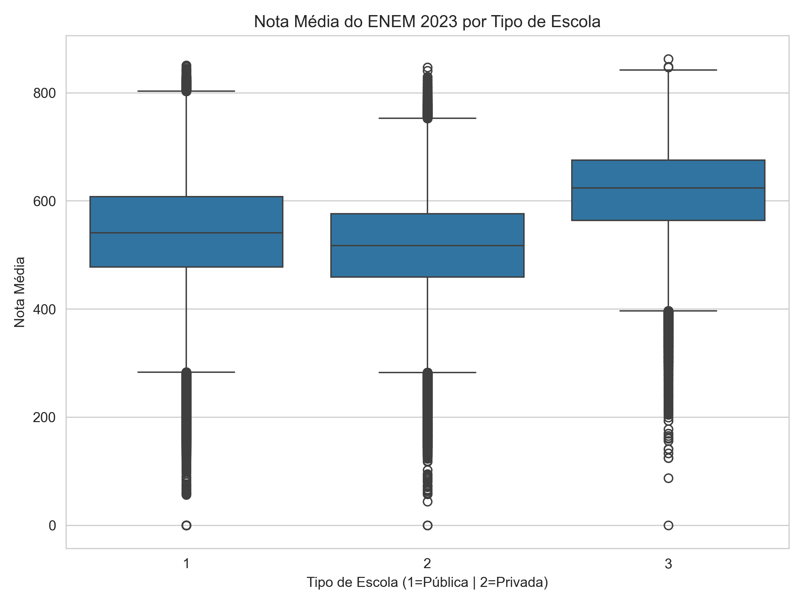
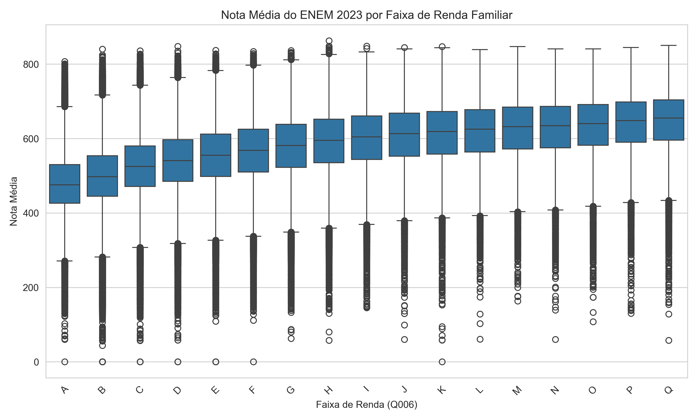
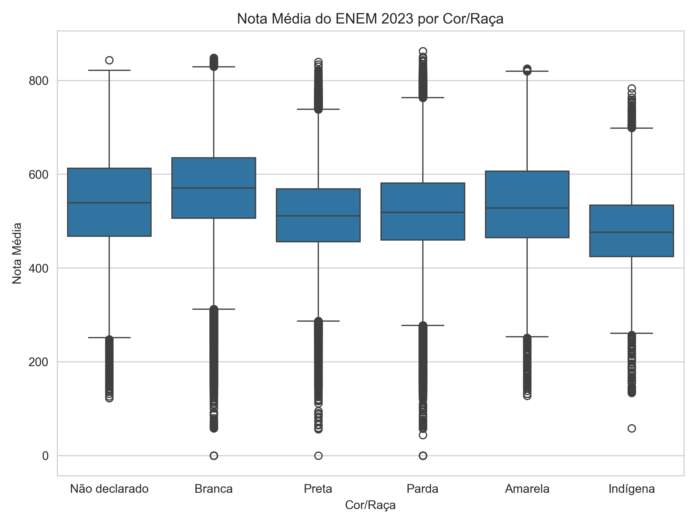
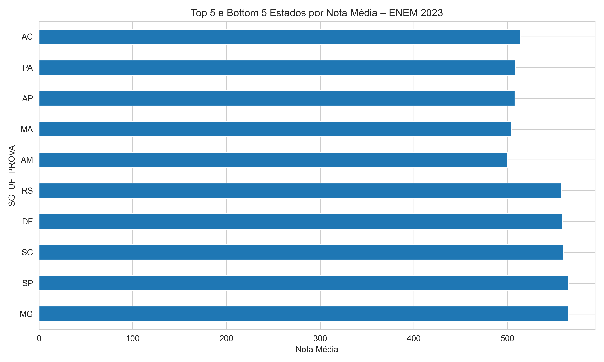
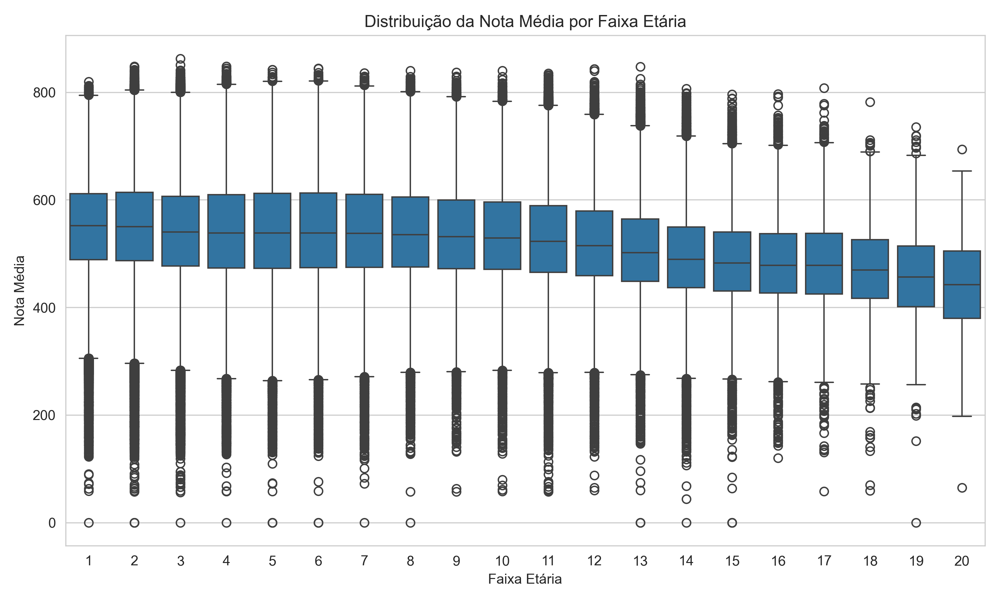

# 📊 Análise do Desempenho dos Participantes do ENEM 2023

Este projeto apresenta uma análise exploratória dos **Microdados do ENEM 2023**, com foco em entender como fatores **socioeconômicos, educacionais e demográficos** se relacionam com o desempenho médio dos participantes.

O objetivo é demonstrar, na prática, como a **análise de dados aplicada à educação** pode gerar insights relevantes para avaliação de políticas públicas, desigualdades educacionais e tomada de decisão baseada em dados.

---

## 🎯 Objetivos do Projeto

- Analisar a relação entre **tipo de escola** e desempenho médio
- Avaliar o impacto da **renda familiar** nas notas do ENEM
- Investigar diferenças de desempenho por **cor/raça**
- Comparar a **nota média por estado**
- Observar variações de desempenho por **faixa etária**
- Aplicar boas práticas de **tratamento de dados em grandes volumes**

---

## 🗂️ Base de Dados

Os dados utilizados são os **Microdados do ENEM 2023**, disponibilizados publicamente pelo INEP.

> ⚠️ Devido ao grande volume do arquivo (~2GB), os dados **não estão versionados neste repositório**.

🔗 Link oficial para download:  
https://www.gov.br/inep/pt-br/acesso-a-informacao/dados-abertos/microdados/enem

---

## 🧹 Tratamento dos Dados

- Leitura dos dados em **chunks** para otimização de memória
- Seleção apenas das colunas relevantes para a análise
- Filtro de participantes **presentes em todas as provas**
- Conversão de variáveis categóricas
- Criação da métrica **nota média**, calculada a partir das notas das provas objetivas e redação

---

## 📈 Principais Análises e Visualizações

### 🏫 Nota Média por Tipo de Escola
Comparação entre participantes de escolas públicas e privadas.

---

### 💰 Nota Média por Faixa de Renda Familiar
Análise da relação entre renda familiar declarada e desempenho no exame.

---

### 🎨 Nota Média por Cor/Raça
Avaliação das desigualdades educacionais segundo a classificação do INEP.

---

### 🗺️ Nota Média por Estado
Comparação do desempenho médio dos participantes por unidade federativa.

---

### 🎂 Nota Média por Faixa Etária
Análise do desempenho conforme a faixa etária dos participantes.

---

## 🛠️ Tecnologias Utilizadas

- Python
- Pandas
- Matplotlib
- Seaborn
- Jupyter Notebook

---

## 📌 Conclusão

A análise evidencia fortes relações entre fatores socioeconômicos e o desempenho no ENEM, reforçando a importância de políticas públicas educacionais baseadas em dados. O projeto demonstra como dados abertos podem ser utilizados para gerar insights relevantes e socialmente significativos.

---

📎 *Projeto desenvolvido para fins educacionais e de portfólio em Análise de Dados.*
